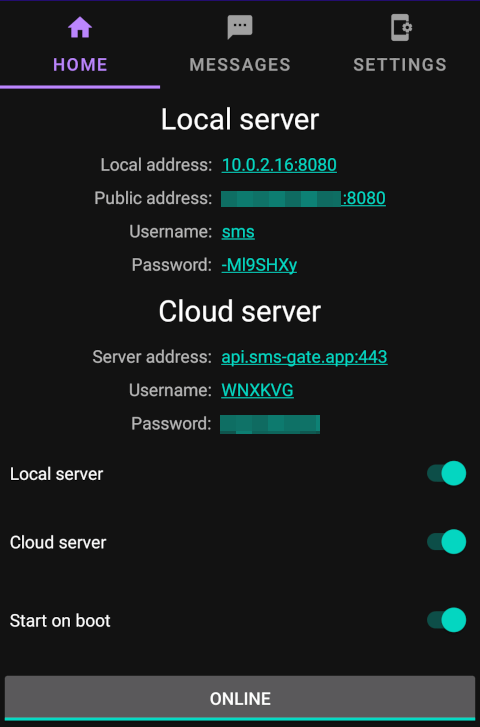

<a name="readme-top"></a>
<!--
*** Thanks for checking out the Best-README-Template. If you have a suggestion
*** that would make this better, please fork the repo and create a pull request
*** or simply open an issue with the tag "enhancement".
*** Don't forget to give the project a star!
*** Thanks again! Now go create something AMAZING! :D
-->


<!-- PROJECT SHIELDS -->
<!--
*** I'm using markdown "reference style" links for readability.
*** Reference links are enclosed in brackets [ ] instead of parentheses ( ).
*** See the bottom of this document for the declaration of the reference variables
*** for contributors-url, forks-url, etc. This is an optional, concise syntax you may use.
*** https://www.markdownguide.org/basic-syntax/#reference-style-links
-->
[![Contributors][contributors-shield]][contributors-url]
[![Forks][forks-shield]][forks-url]
[![Stargazers][stars-shield]][stars-url]
[![Issues][issues-shield]][issues-url]
[![Apache 2.0 License][license-shield]][license-url]


<!-- PROJECT LOGO -->
<br />
<div align="center">
  <a href="https://github.com/capcom6/android-sms-gateway">
    
  </a>

<h3 align="center">SMS Gateway for Android™</h3>

  <p align="center">
    Turns your smartphone into an SMS gateway for sending and receiving messages via API.
    <br />
    <a href="https://sms-gate.app"><strong>Explore the docs »</strong></a>
    <br />
    <br />
    <!-- <a href="https://github.com/capcom6/android-sms-gateway">View Demo</a> -->
    <a href="https://github.com/capcom6/android-sms-gateway/issues">Report Bug</a>
    ·
    <a href="https://github.com/capcom6/android-sms-gateway/issues">Request Feature</a>
  </p>
</div>


<!-- TABLE OF CONTENTS -->
- [About The Project](#about-the-project)
  - [Features](#features)
  - [Ideal For](#ideal-for)
  - [Built With](#built-with)
- [Installation](#installation)
  - [Build Variants](#build-variants)
  - [Prerequisites](#prerequisites)
    - [Permissions](#permissions)
  - [Installation from APK](#installation-from-apk)
- [Getting Started](#getting-started)
  - [Local Server](#local-server)
  - [Cloud Server](#cloud-server)
  - [Webhooks](#webhooks)
- [Roadmap](#roadmap)
- [Contributing](#contributing)
- [License](#license)
- [Contact](#contact)
  - [Links](#links)

<!-- ABOUT THE PROJECT -->
## About The Project

<p align="center"></p>


SMS Gateway turns your Android smartphone into an SMS gateway. It's a lightweight application that allows you to send SMS messages programmatically via an API or CLI tool and receive webhooks on incoming SMS. This makes it ideal for integrating SMS functionality into your own applications or services.

### Features

📱 Core Functionality:

- 🆓 **No registration required:** No registration or email is required to create an account. In local mode, you don't need an account at all!
- 📨 **Send and Receive SMS via API:** Use [our API](https://docs.sms-gate.app/integration/api/) to send messages directly from your applications or services.
- 🤖 **Support for Android 5.0 and above:** Compatible with Android 5.0 and later versions. [See Android 15 Note](https://docs.sms-gate.app/faq/general/#does-the-app-support-android-15)

💬 Message Handling:

- 📜 **Multipart messages:** Send long messages with auto-partitioning.
- 📊 **Message status tracking:** Monitor the status of sent messages in real-time.
- 🔔 **Real-time incoming message notifications:** Receive instant SMS and MMS notifications via webhooks.
- 📖 **Read received messages:** Access [previously received messages](https://docs.sms-gate.app/features/reading-messages/) via the same webhooks used for real-time notifications.

🔒 Security and Privacy:

- 🔐 **End-to-end encryption:** Encrypts message content and recipients' phone numbers before sending them to the API and decrypts them on the device.
- 🏢 **Private server support:** Use a backend server in your own infrastructure for enhanced security.

🔧 Advanced Features:

- 💳 **Multiple SIM card support:** Supports devices with [multiple SIM cards](https://docs.sms-gate.app/features/multi-sim/).
- 📱📱 **Multiple device support:** Connect [multiple devices](https://docs.sms-gate.app/features/multi-device/) to the same account with Cloud or Private server. Messages sent via the server are distributed across all connected devices.
- 💾 **Data SMS support:** Send and receive binary [data payloads](https://docs.sms-gate.app/features/data-sms.md) via SMS for IoT commands, encrypted messages, and other specialized use cases.

🔌 Integration:

- 🪝 **Webhooks:** Set up [webhooks](https://docs.sms-gate.app/features/webhooks/) to be triggered on specified events.

### Ideal For

- 🔐 **Authentication & Verification:** Secure user accounts and transactions with SMS-based two-factor authentication, minimizing the risk of unauthorized access.
- 📩 **Transactional Messages:** Send confirmation messages for user actions, enhancing the reliability and perception of your brand.
- ⏰ **SMS Reminders:** Prompt users about upcoming events or appointments to ensure engagement and reduce missed opportunities.
- 🔔 **SMS Notifications:** Deliver immediate notifications to users for important updates, offers, and service enhancements.
- 📊 **User Feedback:** Solicit and collect user feedback through SMS, providing valuable insights for improving your services.

*Note*: It is not recommended to use this for batch sending due to potential mobile operator restrictions.

<p align="right">(<a href="#readme-top">back to top</a>)</p>


### Built With

- [](https://kotlinlang.org/)
- [](https://ktor.io/)
- [](https://developer.android.com/training/data-storage/room)
- [](https://firebase.google.com/)

<p align="right">(<a href="#readme-top">back to top</a>)</p>

## Installation

You can install app to your device from [prebuilt APK](https://github.com/capcom6/android-sms-gateway/releases).

### Build Variants

The project provides two pre-built variants:

- **Secure (release) build**: Production-ready with strict security configurations. This is the recommended build for production deployments.
- **Insecure build**: For development and testing with cleartext traffic allowed. **This build should never be used in public environments.**

### Prerequisites

You need an Android device with Android 5.0 (Lollipop) or above for using the application.

#### Permissions

To use the application, you need to grant the following permissions:

- **SEND_SMS**: This permission is required to send SMS messages.
- **READ_PHONE_STATE**: This permission is optional. If you want to select the SIM card, you can grant this permission.
- **READ_SMS**: This permission is optional. If you want to read previous SMS messages, you need to grant this permission.
- **RECEIVE_SMS**: This permission is optional. If you want to receive webhooks on incoming SMS, you need to grant this permission.
- **RECEIVE_MMS**, **RECEIVE_WAP_PUSH**: This permissions are optional. If you want to receive webhooks on incoming MMS messages, you need to grant these permissions.

### Installation from APK

1. Navigate to the [Releases](https://github.com/capcom6/android-sms-gateway/releases) page.
2. Download the latest APK file from the list of available releases.
3. Transfer the APK file to your Android device.
4. On your Android device, go to **Settings** > **Security** (or **Privacy** on some devices).
5. Enable the **Unknown sources** option to allow installation of apps from sources other than the Play Store.
6. Use a file manager app to navigate to the location of the downloaded APK file.
7. Tap on the APK file to start the installation process.
8. Follow the on-screen prompts to complete the installation.

<p align="right">(<a href="#readme-top">back to top</a>)</p>

<!-- GETTING STARTED -->
## Getting Started

_For integration examples, please refer to the [CLI Tool Documentation](https://sms-gate.app/integration/cli/) and [API Documentation](https://sms-gate.app/integration/api/)_

The SMS Gateway for Android can work in two modes: with a Local Server started on the device or with a Cloud Server. The basic API is the same for both modes and is documented on the [SMS Gateway for Android API Documentation](https://capcom6.github.io/android-sms-gateway/) page.

### Local Server

<div align="center">
    
</div>

This mode is ideal for sending messages from a local network.

1. Launch the app on your device.
2. Toggle the `Local Server` switch to the "on" position.
3. Tap the `Offline` button at the bottom of the screen to activate the server.
4. In the `Local Server` section, your device's local and public IP addresses will be displayed, along with the credentials for basic authentication. Note that the public IP address is only accessible if you have a public (or "white") IP and your firewall is configured correctly.
5. To send a message from within the local network, execute a `curl` command like the one below. Replace `<username>`, `<password>`, and `<device_local_ip>` with the actual values provided in the previous step:

    ```sh
    curl -X POST -u <username>:<password> \
      -H "Content-Type: application/json" \
      -d '{ "textMessage": { "text": "Hello, doctors!" }, "phoneNumbers": ["+19162255887", "+19162255888"] }' \
      http://<device_local_ip>:8080/message
    ```

    Alternatively, you can use the CLI Tool:

    ```sh
    smsgate -e 'http://<device_local_ip>:8080/message' -u <username> -p <password> \
      send --phones '+19162255887,+19162255888' 'Hello, doctors!'
    ```

6. To enqueue an MMS message using JSON (text + media metadata):

    ```sh
    curl -X POST -u <username>:<password> \
      -H "Content-Type: application/json" \
      -d '{
        "phoneNumbers": ["+19162255887"],
        "mmsMessage": {
          "text": "Hello with media",
          "attachments": [
            {
              "mimeType": "image/jpeg",
              "filename": "photo.jpg",
              "data": "<base64-encoded-bytes>"
            }
          ]
        }
      }' \
      http://<device_local_ip>:8080/message
    ```

7. To enqueue an MMS message using multipart/form-data:

    ```sh
    curl -X POST -u <username>:<password> \
      -F "phoneNumbers=+19162255887" \
      -F "text=Hello with image" \
      -F "file=@/path/to/photo.jpg;type=image/jpeg" \
      http://<device_local_ip>:8080/message
    ```

### Cloud Server

<div align="center">
    
</div>

Use the cloud server mode when dealing with dynamic or shared device IP addresses.

1. Launch the app on your device.
2. Toggle the `Cloud Server` switch to the "on" position.
3. Tap the `Online` button located at the bottom of the screen to connect to the cloud server.
4. In the `Cloud Server` section, the credentials for basic authentication will be displayed.
5. To send a message via the cloud server, perform a `curl` request with a command similar to the following, substituting `<username>` and `<password>` with the actual values obtained in step 4:

    ```sh
    curl -X POST -u <username>:<password> \
      -H "Content-Type: application/json" \
      -d '{ "textMessage": { "text": "Hello, doctors!" }, "phoneNumbers": ["+19162255887", "+19162255888"] }' \
      https://api.sms-gate.app/3rdparty/v1/message
    ```

    Or with CLI:

    ```sh
    smsgate -u <username> -p <password> \
      send --phones '+19162255887,+19162255888' 'Hello, doctors!'
    ```

For further privacy, you can deploy your own private server. See the [Private Server](https://sms-gate.app/getting-started/private-server/) section for more details.

### Webhooks

Use webhooks to receive notifications for messaging events (e.g., incoming SMS and MMS).

Follow these steps to set up webhooks:

1. Set up your own HTTP server with a valid SSL certificate to receive webhooks. For testing purposes, [webhook.site](https://webhook.site) can be useful.
2. Register your webhook with an API request:

    ```sh
    curl -X POST -u <username>:<password> \
      -H "Content-Type: application/json" \
      -d '{ "id": "unique-id", "url": "https://webhook.site/<your-uuid>", "event": "sms:received" }' \
      http://<device_local_ip>:8080/webhooks
    ```
3. Send an SMS to the device.
4. The application will dispatch POST request to the specified URL with a payload such as:

    ```json
    {
      "event": "sms:received",
      "payload": {
        "messageId": "msg_12345abcde",
        "message": "Received SMS text",
        "phoneNumber": "+19162255887",
        "simNumber": 1,
        "receivedAt": "2024-06-07T11:41:31.000+07:00"
      }
    }
    ```

   Incoming MMS webhooks use the `mms:received` event and include media metadata:

    ```json
    {
      "event": "mms:received",
      "payload": {
        "messageId": "mms_123",
        "transactionId": "tx_123",
        "phoneNumber": "+19162255887",
        "attachments": [
          {
            "id": "part_1",
            "mimeType": "image/jpeg",
            "filename": "photo.jpg",
            "size": 2048,
            "width": 800,
            "height": 600,
            "durationMs": null,
            "sha256": "<sha256>",
            "downloadUrl": "/media/part_1?expires=<timestamp>&token=<signature>"
          }
        ]
      }
    }
    ```

   Use the signed `downloadUrl` path with basic auth credentials to fetch stored media.

5. To deregister a webhook, execute a `curl` request using the following pattern:

    ```sh
    curl -X DELETE -u <username>:<password> \
      http://<device_local_ip>:8080/webhooks/unique-id
    ```

For cloud mode the process is similar, simply change the URL to https://api.sms-gate.app/3rdparty/v1/webhooks. Webhooks in Local and Cloud mode are independent.

*Note*: Webhooks are transmitted directly from the device; therefore, the device must have an outgoing internet connection. As the requests originate from the device, incoming messages remain inaccessible to us.

*Known MMS limitation*: local API and storage pipelines are implemented for outbound MMS requests, but carrier-level MMS transmission still depends on full Android transport support on the device/network combination.


<p align="right">(<a href="#readme-top">back to top</a>)</p>


<!-- ROADMAP -->
## Roadmap

- [x] Add functionality to modify user credentials.
- [x] Introduce option to adjust the local server port.
- [x] Send notifications to an external server when the status of a message changes.
- [ ] Incorporate scheduling capabilities for dispatching messages at specific times.
- [ ] Implement region-based restrictions to prevent international SMS.
- [ ] Provide an API endpoint to retrieve the list of available SIM cards on the device.
- [x] Include detailed error messages in responses and logs.

See the [open issues](https://github.com/capcom6/android-sms-gateway/issues) for a full list of proposed features (and known issues).

<p align="right">(<a href="#readme-top">back to top</a>)</p>


<!-- CONTRIBUTING -->
## Contributing

Contributions are what make the open source community such an amazing place to learn, inspire, and create. Any contributions you make are **greatly appreciated**.

If you have a suggestion that would make this better, please fork the repo and create a pull request. You can also simply open an issue with the tag "enhancement".
Don't forget to give the project a star! Thanks again!

1. Fork the Project
2. Create your Feature Branch (`git checkout -b feature/AmazingFeature`)
3. Commit your Changes (`git commit -m 'Add some AmazingFeature'`)
4. Push to the Branch (`git push origin feature/AmazingFeature`)
5. Open a Pull Request

<p align="right">(<a href="#readme-top">back to top</a>)</p>


<!-- LICENSE -->
## License

Distributed under the Apache-2.0 license. See [LICENSE](LICENSE) for more information.

<p align="right">(<a href="#readme-top">back to top</a>)</p>


<!-- CONTACT -->
## Contact

If you have any questions or suggestions, feel free to reach out through the following channels:

- **Issue Tracker:** [https://github.com/capcom6/android-sms-gateway/issues](https://github.com/capcom6/android-sms-gateway/issues)
- **Email:** [support@sms-gate.app](mailto:support@sms-gate.app)
- **Discord:** [Join our Discord server](https://discord.gg/vv9raFK4gX)

### Links

- **Website:** [https://sms-gate.app](https://sms-gate.app)
- **Documentation:** [https://docs.sms-gate.app](https://docs.sms-gate.app)
- **Status Page:** [https://status.sms-gate.app](https://status.sms-gate.app)
- **Project:** [https://github.com/android-sms-gateway](https://github.com/android-sms-gateway)
- **Main Repository:** [https://github.com/capcom6/android-sms-gateway](https://github.com/capcom6/android-sms-gateway)
- **Author GitHub:** [capcom6](https://github.com/capcom6)


<p align="right">(<a href="#readme-top">back to top</a>)</p>


<!-- ACKNOWLEDGMENTS -->
<!-- ## Acknowledgments

Use this space to list resources you find helpful and would like to give credit to. I've included a few of my favorites to kick things off!

* [Choose an Open Source License](https://choosealicense.com)
* [GitHub Emoji Cheat Sheet](https://www.webpagefx.com/tools/emoji-cheat-sheet)
* [Malven's Flexbox Cheatsheet](https://flexbox.malven.co/)
* [Malven's Grid Cheatsheet](https://grid.malven.co/)
* [Img Shields](https://shields.io)
* [GitHub Pages](https://pages.github.com)
* [Font Awesome](https://fontawesome.com)
* [React Icons](https://react-icons.github.io/react-icons/search)

<p align="right">(<a href="#readme-top">back to top</a>)</p> -->


<!-- MARKDOWN LINKS & IMAGES -->
<!-- https://www.markdownguide.org/basic-syntax/#reference-style-links -->
[contributors-shield]: https://img.shields.io/github/contributors/capcom6/android-sms-gateway.svg?style=for-the-badge
[contributors-url]: https://github.com/capcom6/android-sms-gateway/graphs/contributors
[forks-shield]: https://img.shields.io/github/forks/capcom6/android-sms-gateway.svg?style=for-the-badge
[forks-url]: https://github.com/capcom6/android-sms-gateway/network/members
[stars-shield]: https://img.shields.io/github/stars/capcom6/android-sms-gateway.svg?style=for-the-badge
[stars-url]: https://github.com/capcom6/android-sms-gateway/stargazers
[issues-shield]: https://img.shields.io/github/issues/capcom6/android-sms-gateway.svg?style=for-the-badge
[issues-url]: https://github.com/capcom6/android-sms-gateway/issues
[license-shield]: https://img.shields.io/github/license/capcom6/android-sms-gateway.svg?style=for-the-badge
[license-url]: https://github.com/capcom6/android-sms-gateway/blob/master/LICENSE
