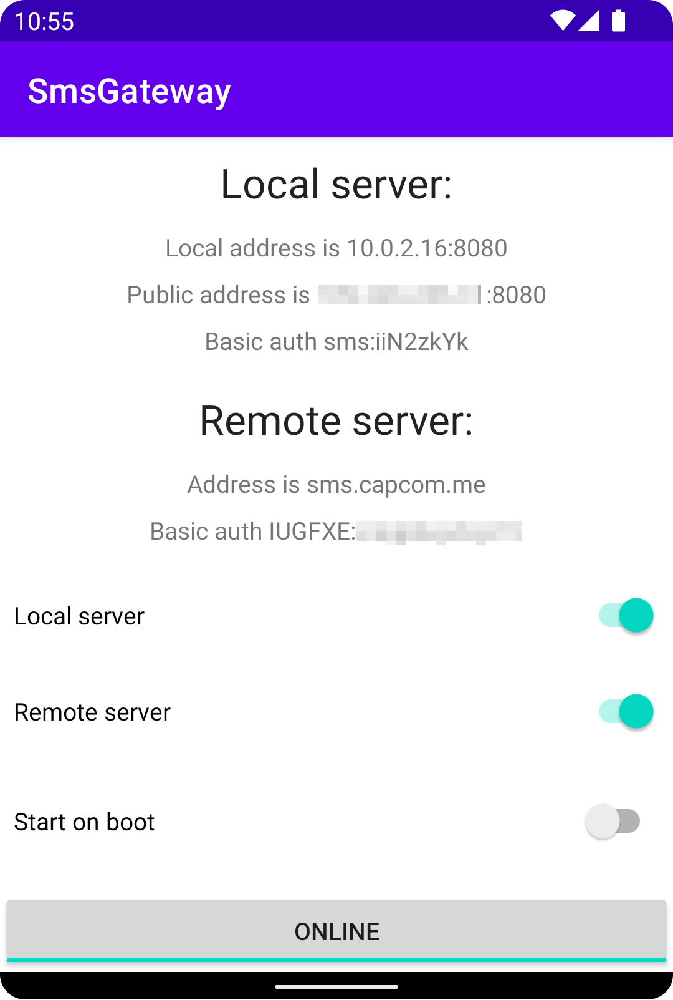

<a name="readme-top"></a>
<!--
*** Thanks for checking out the Best-README-Template. If you have a suggestion
*** that would make this better, please fork the repo and create a pull request
*** or simply open an issue with the tag "enhancement".
*** Don't forget to give the project a star!
*** Thanks again! Now go create something AMAZING! :D
-->


<!-- PROJECT SHIELDS -->
<!--
*** I'm using markdown "reference style" links for readability.
*** Reference links are enclosed in brackets [ ] instead of parentheses ( ).
*** See the bottom of this document for the declaration of the reference variables
*** for contributors-url, forks-url, etc. This is an optional, concise syntax you may use.
*** https://www.markdownguide.org/basic-syntax/#reference-style-links
-->
[![Contributors][contributors-shield]][contributors-url]
[![Forks][forks-shield]][forks-url]
[![Stargazers][stars-shield]][stars-url]
[![Issues][issues-shield]][issues-url]
[![Apache 2.0 License][license-shield]][license-url]


<!-- PROJECT LOGO -->
<br />
<div align="center">
  <a href="https://github.com/capcom6/android-sms-gateway">
    
  </a>

<h3 align="center">Android SMS Gateway</h3>

  <p align="center">
    Turns your smartphone into an SMS gateway for sending messages via API.
    <br />
    <!-- <a href="https://github.com/capcom6/android-sms-gateway"><strong>Explore the docs »</strong></a>
    <br />
    <br />
    <a href="https://github.com/capcom6/android-sms-gateway">View Demo</a> -->
    ·
    <a href="https://github.com/capcom6/android-sms-gateway/issues">Report Bug</a>
    ·
    <a href="https://github.com/capcom6/android-sms-gateway/issues">Request Feature</a>
  </p>
</div>


<!-- TABLE OF CONTENTS -->
- [About The Project](#about-the-project)
  - [Built With](#built-with)
- [Getting Started](#getting-started)
  - [Prerequisites](#prerequisites)
  - [Installation from APK](#installation-from-apk)
- [Usage](#usage)
  - [Send SMS with local server](#send-sms-with-local-server)
  - [Send SMS with sms.capcom.me](#send-sms-with-smscapcomme)
- [Roadmap](#roadmap)
- [Contributing](#contributing)
- [License](#license)
- [Contact](#contact)

<!-- ABOUT THE PROJECT -->
## About The Project

<p align="center"></p>


Android SMS Gateway is a lightweight application that allows you to use your Android smartphone as an SMS gateway. With this app, you can send SMS messages programmatically via API, making it ideal for integrating SMS functionality into your own applications or services. The application supports Android 5.0 and above, and offers features such as message status tracking, starting at boot, and protection from going to sleep. Whether you need to send notifications, alerts, or two-factor authentication codes, Android SMS Gateway provides a convenient and reliable solution.

The project is in the MVP stage.

<p align="right">(<a href="#readme-top">back to top</a>)</p>


### Built With

- [](https://kotlinlang.org/)
- [](https://ktor.io/)
- [](https://developer.android.com/training/data-storage/room)
- [](https://firebase.google.com/)

<p align="right">(<a href="#readme-top">back to top</a>)</p>


<!-- GETTING STARTED -->
## Getting Started

You can install app to your device from prebuilt APK or by building from sources.

### Prerequisites

You need an Android device with Android 5.0 (Lollipop) or above for using the application.

### Installation from APK

1. Navigate to the [Releases](link-to-releases) page.
2. Download the latest APK file from the list of available releases.
3. Transfer the APK file to your Android device.
4. On your Android device, go to **Settings** > **Security** (or **Privacy** on some devices).
5. Enable the **Unknown sources** option to allow installation of apps from sources other than the Play Store.
6. Use a file manager app to navigate to the location of the downloaded APK file.
7. Tap on the APK file to start the installation process.
8. Follow the on-screen prompts to complete the installation.

<p align="right">(<a href="#readme-top">back to top</a>)</p>


<!-- USAGE EXAMPLES -->
## Usage

The Android SMS Gateway can work in two modes: with a local server started on the device or with a cloud server at [sms.capcom.me](https://sms.capcom.me). The basic API is the same for both modes and is documented on the [Android SMS Gateway API Documentation](https://capcom6.github.io/android-sms-gateway/).


### Send SMS with local server

Application can start web-server on the device, so it can be used without any external services. This mode is recommended for sending messages from local network.

1. Start the app on the device.
2. Activate the `Local server` switch.
3. Tap the `Offline` button at the bottom of the screen.
4. In the `Local server` section, the local and public addresses of the device, along with the credentials for basic authentication, will be displayed. Please note that the public address is only usable if you have a "white" IP address and have correctly configured your firewall.
5. Make a `curl` call from the local network using a command like the following, replacing `<username>`, `<password>`, and `<device_local_ip>` with the values obtained in step 4: 
   
   ```
   curl -X POST -u <username>:<password> -H "Content-Type: application/json" -d '{ "message": "Hello, world!", "phoneNumbers": ["79990001234", "79995556677"] }' http://<device_local_ip>:8080/message
   ```

### Send SMS with sms.capcom.me

If you need to send messages with dynamic or shared device IP you can use the cloud server.

1. Start the app on the device.
2. Activate the `Cloud server` switch.
3. Tap the `Offline` button at the bottom of the screen.
4. In the `Cloud server` section, the credentials for basic authentication will be displayed.
5. Make a curl call using a command like the following, replacing `<username>` and `<password>` with the values obtained in step 4:
   
    ```
    curl -X POST -u <username>:<password> -H "Content-Type: application/json" -d '{ "message": "Hello, world!", "phoneNumbers": ["79990001234", "79995556677"] }' https://sms.capcom.me/api/3rdparty/v1/message
    ```

<!-- _For more examples, please refer to the [Documentation](https://example.com)_ -->

<p align="right">(<a href="#readme-top">back to top</a>)</p>


<!-- ROADMAP -->
## Roadmap

- [ ] Add functionality to modify user credentials.
- [ ] Introduce option to adjust the local server port.
- [ ] Send notifications to an external server when the status of a message changes.
- [ ] Incorporate scheduling capabilities for dispatching messages at specific times.
- [ ] Implement region-based restrictions to prevent international SMS.
- [ ] Provide an API endpoint to retrieve the list of available SIM cards on the device.
- [ ] Include detailed error messages in responses and logs.

See the [open issues](https://github.com/capcom6/android-sms-gateway/issues) for a full list of proposed features (and known issues).

<p align="right">(<a href="#readme-top">back to top</a>)</p>


<!-- CONTRIBUTING -->
## Contributing

Contributions are what make the open source community such an amazing place to learn, inspire, and create. Any contributions you make are **greatly appreciated**.

If you have a suggestion that would make this better, please fork the repo and create a pull request. You can also simply open an issue with the tag "enhancement".
Don't forget to give the project a star! Thanks again!

1. Fork the Project
2. Create your Feature Branch (`git checkout -b feature/AmazingFeature`)
3. Commit your Changes (`git commit -m 'Add some AmazingFeature'`)
4. Push to the Branch (`git push origin feature/AmazingFeature`)
5. Open a Pull Request

<p align="right">(<a href="#readme-top">back to top</a>)</p>


<!-- LICENSE -->
## License

Distributed under the Apache-2.0 license. See `LICENSE.txt` for more information.

<p align="right">(<a href="#readme-top">back to top</a>)</p>


<!-- CONTACT -->
## Contact

Project Link: [https://github.com/capcom6/android-sms-gateway](https://github.com/capcom6/android-sms-gateway)

<p align="right">(<a href="#readme-top">back to top</a>)</p>


<!-- ACKNOWLEDGMENTS -->
<!-- ## Acknowledgments

Use this space to list resources you find helpful and would like to give credit to. I've included a few of my favorites to kick things off!

* [Choose an Open Source License](https://choosealicense.com)
* [GitHub Emoji Cheat Sheet](https://www.webpagefx.com/tools/emoji-cheat-sheet)
* [Malven's Flexbox Cheatsheet](https://flexbox.malven.co/)
* [Malven's Grid Cheatsheet](https://grid.malven.co/)
* [Img Shields](https://shields.io)
* [GitHub Pages](https://pages.github.com)
* [Font Awesome](https://fontawesome.com)
* [React Icons](https://react-icons.github.io/react-icons/search)

<p align="right">(<a href="#readme-top">back to top</a>)</p> -->


<!-- MARKDOWN LINKS & IMAGES -->
<!-- https://www.markdownguide.org/basic-syntax/#reference-style-links -->
[contributors-shield]: https://img.shields.io/github/contributors/capcom6/android-sms-gateway.svg?style=for-the-badge
[contributors-url]: https://github.com/capcom6/android-sms-gateway/graphs/contributors
[forks-shield]: https://img.shields.io/github/forks/capcom6/android-sms-gateway.svg?style=for-the-badge
[forks-url]: https://github.com/capcom6/android-sms-gateway/network/members
[stars-shield]: https://img.shields.io/github/stars/capcom6/android-sms-gateway.svg?style=for-the-badge
[stars-url]: https://github.com/capcom6/android-sms-gateway/stargazers
[issues-shield]: https://img.shields.io/github/issues/capcom6/android-sms-gateway.svg?style=for-the-badge
[issues-url]: https://github.com/capcom6/android-sms-gateway/issues
[license-shield]: https://img.shields.io/github/license/capcom6/android-sms-gateway.svg?style=for-the-badge
[license-url]: https://github.com/capcom6/android-sms-gateway/blob/master/LICENSE.txt
[product-screenshot]: docs/screenshot.png

